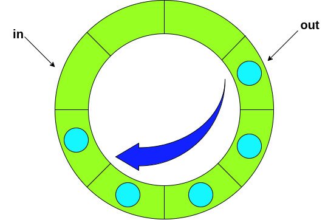

The Bounded-Buffer Problem also known as the Producer-Consumer Problem is a classic synchronization challenge central to understanding process coordination in operating systems. The problem revolves around two processes: producers, which generate data and place it in a
shared buffer, and consumers, which retrieve data from the buffer for processing. This shared buffer has limited capacity, requiring synchronization to avoid errors like data corruption or lost updates.

Suppose we have a circular buffer with two pointers **in** and **out** to indicate the next available position for depositing data and the position that contains the next data to be retrieved. See the diagram below. There are two groups of threads, **producers** and **consumers**. Each producer deposits a data items into the **in** position and advances the pointer **in**, and each consumer retrieves the d*ata item in pos*ition **out** and advances the pointer **out**.

## Key Concepts

* ### Shared Buffer Management:
  The producer and consumer share a common memory area (the buffer). The size of the buffer determines how many data items can be held simultaneously.

* ### Synchronization Mechanisms:
   To prevent race conditions, synchronization primitives like **mutexes** (mutual exclusion locks), **semaphores**, or **condition variables** are used. These mechanisms ensure:

   * Producers do not write to a full buffer.
   * Consumers do not read from an empty buffer.
   * Only one process accesses the critical section at a time.

* ### States and Actions:
  The system has defined states, such as ***Ready**, **Busy**, or **OK**, and actions like producing (put()) or consuming (get()), which transition the system between states.

## Analysis

First, because the buffer is shared by all threads, they have to be protected so that race condition will not occur. So, this requires a mutex lock or a binary semaphore. A producer cannot deposit its data if the buffer is full. Similarly, a consumer cannot retrieve any data if the buffer is empty. On the other hand, if the buffer is not full, a producer can deposit its data. After this, the buffer contains data, and, as a result, a consumer should be allowed to retrieve a data item. Similarly, after a consumer retrieves a data item, the buffer is not full, and a producer should be allowed to deposit its data.

Putting these observations together, we know that:

  * A producer must wait until the buffer is not full, deposit its data, and then notify the consumers that the buffer is not empty.

  * A consumer, on the other hand, must wait until the buffer is not empty, retrieve a data item, and then notify the producers that the buffer is not full.

Of course, before a producer or a consumer can have access to the buffer, it must lock the
buffer. After a producer and consumer finishes using the buffer, it must unlock the buffer.
Combined these activities together, we have the following diagram:

[bounded-buffer-analysis](images/BB2.png)

In summary, we need a semaphore to block producers when the buffer is full, a semaphore to
block consumers when the buffer is empty, and a binary semaphore to guarantee mutex
exclusion when the buffer is accessed. Note that the first semaphore is signaled (by a
consumer) when the buffer is not full, and the second is signaled (by a producer) when the
buffer is not empty.

What are the initial values? The semaphore for blocking producers when buffer is full must have an initial value equal to the buffer size. Why? Because the buffer is empty initially, we can allow that number of producers to pass through. Since each passing through producer causes the counter to be decreased by one, when the buffer is full, the semaphore counter becomes zero and all subsequent producers will be blocked. The initial value of the semaphore for blocking consumers is zero, because initially the buffer is empty and no consumer should be allowed to retrieve. The binary semaphore for locking the buffer should have an initial value 1.