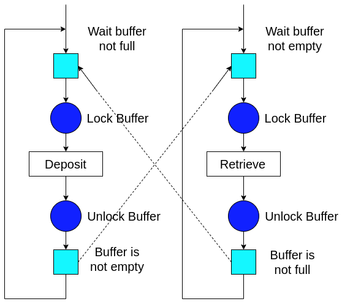

## **Introduction**

The **Bounded Buffer Problem** is a **classical synchronization problem** in operating systems that models the interaction between **producers** and **consumers** sharing a **fixed-size buffer**. 

This problem represents a **real-world scenario** where data is **produced** and **consumed concurrently**, requiring proper coordination to avoid issues like **data corruption**, **buffer overflow**, and **starvation**.

A **virtual lab simulation** of the bounded buffer problem helps students understand the challenges of **concurrent programming** and the importance of **synchronization mechanisms** in ensuring **data consistency** and **system stability**.

# **Example of Bounded Buffer Problem in an Operating System to Illustrate the Problem

Let’s consider a scenario where two processes—a producer and a consumer—are sharing a common memory buffer without any synchronization mechanisms like semaphores or mutexes. This example highlights the problems that can arise due to the lack of proper coordination:

## **Scenario**

- A text editor (**producer**) writes characters into a shared buffer.
- A spell checker (**consumer**) reads characters from the buffer to check for spelling errors.
- The buffer size is fixed at **5 characters**.

## **Initial State**

- The buffer is **empty**.
- The **producer** starts generating characters and placing them into the buffer.
- The **consumer** starts reading and processing characters from the buffer.

## **Potential Unsafe Scenarios**

### 1. **Race Condition**

- If the producer and consumer try to access the buffer at the same time, they could corrupt the data.
- **Example:**  
  The producer writes `"HELLO"` into the buffer, but before it finishes, the consumer starts reading and only gets `"HE"` because the producer was interrupted halfway.

### 2. **Overwriting Data (Lost Update Problem)**

- If the producer is faster than the consumer, it could overwrite data before the consumer has a chance to process it.
- **Example:**
  - Producer writes `"HELLO"` → Consumer starts reading `"HE"`.
  - Producer writes `"WORLD"` before the consumer finishes → Consumer reads `"HEWOR"` (corrupted output).

### 3. **Buffer Overflow**

- If the producer keeps adding data when the buffer is full, it could result in a buffer overflow.
- **Example:**
  - Buffer size = 5 → Producer tries to write `"HELLO"` + `"WORLD"` → Causes overflow, and some data is lost.

### 4. **Reading from an Empty Buffer**

- If the consumer starts reading from the buffer while it's empty, it might receive garbage values or cause a crash.
- **Example:**
  - Consumer expects data → Buffer is empty → Consumer reads uninitialized values.

### 5. **Deadlock**

- If both the producer and consumer reach a state where they are waiting for each other to act, the system can enter a deadlock.
- **Example:**
  - Producer waits for space in the buffer to become available.
  - Consumer waits for data to be added to the buffer.
  - Neither can proceed, causing a permanent block.

## **Why We Need Semaphores or Mutexes**

- **Semaphores** help regulate how many slots are available for the producer and consumer, preventing overflow and underflow.
- **Mutexes** ensure that only one process accesses the buffer at a time, preventing race conditions and data corruption.
- Proper synchronization mechanisms prevent these issues and maintain the integrity and consistency of the data exchange.

## **Conclusion**

This example illustrates how the lack of synchronization causes unpredictable and inconsistent behavior, which is exactly why the **Bounded Buffer Problem** needs to be solved with **semaphores** and **mutexes**.

# How We Solve the Bounded Buffer Problem

Suppose we have a **circular buffer** with two pointers:

- **`in`** → Indicates the next available position for **depositing data**.
- **`out`** → Indicates the position that contains the next data to be **retrieved**.

The diagram below represents the circular buffer concept:

## Key Concepts

### Shared Buffer Management
- The **producer** and **consumer** share a **common memory area** (the buffer).
- The size of the buffer determines how many data items can be held simultaneously.

---

### Synchronization Mechanisms
To prevent **race conditions**, synchronization primitives like:
- **Mutexes** (mutual exclusion locks)
- **Semaphores**
- **Condition Variables**

are used to ensure:
- Producers do **not write** to a **full buffer**.
- Consumers do **not read** from an **empty buffer**.
- Only **one process** accesses the **critical section** at a time.

---

### States and Actions
The system has defined states:
- **Ready**
- **Busy**
- **OK**

And actions such as:
- **Producing** (`put()`)
- **Consuming** (`get()`)

These actions **transition the system** between different states.

---

## Analysis

Since the buffer is **shared by all threads**, it must be **protected** to prevent **race conditions**.  
This requires the use of a **mutex lock** or a **binary semaphore**.

### Important Conditions
- A **producer** cannot deposit its data if the **buffer is full**.
- A **consumer** cannot retrieve data if the **buffer is empty**.
- If the buffer is **not full**, a producer can deposit its data.
- If the buffer is **not empty**, a consumer can retrieve a data item.

---

### How It Works

1. A **producer** must:
    - Wait until the buffer is **not full**.
    - Deposit its data.
    - Notify consumers that the buffer is **not empty**.

2. A **consumer** must:
    - Wait until the buffer is **not empty**.
    - Retrieve a data item.
    - Notify producers that the buffer is **not full**.

Additionally:
- **Before** accessing the buffer, the producer/consumer must **lock** the buffer.
- **After** finishing, they must **unlock** the buffer.

---

### Overall Flow

Below is the conceptual flow of the buffer access and synchronization:

---

## Summary

To implement this solution, we need:

| Semaphore | Initial Value | Purpose |
|:--------:|:-------------:|:-------------------------------------------------------------:|
| **empty** | Buffer Size  | Blocks **producers** when buffer is **full**. |
| **full**  | 0            | Blocks **consumers** when buffer is **empty**. |
| **mutex** | 1            | Guarantees **mutual exclusion** when accessing the buffer. |

---

### Explanation of Initial Values
- **empty = Buffer Size**  
  → Initially, the buffer is empty, so we can allow that many producers to deposit.  
  Each deposit **decreases** the count by one. When full, `empty = 0`, blocking producers.

- **full = 0**  
  → Buffer is initially empty, so consumers should **not be allowed to retrieve**.

- **mutex = 1**  
  → A binary semaphore to ensure **exclusive access** to the buffer.

---
